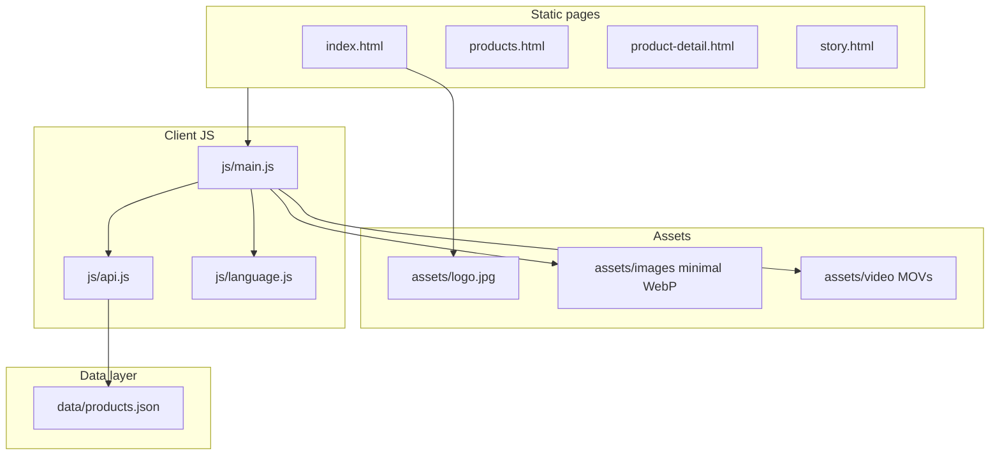

# WASAI Tea — project summary & architecture

This document records the **original static-site plan**, the **implemented architecture**, and **follow-up work** so future sessions (human or AI) can extend the site or migrate to a dynamic backend.

---

## Product context

- **Brand:** WASAI (双江佤赛茶业 + 东半山古树茶厂), East Half Mountain (Mengku, Yunnan).
- **Audience (stated):** US B2C consumers—first-time pu’er drinkers and enthusiasts/collectors.
- **Positioning:** Community-first story, organic/traditional craft, bilingual **EN / 中文** with a **story-first** CTA.

---

## Original plan (architecture goals)

### Goals

1. **Static demo** deployable on **Cloudflare Pages** (no server required).
2. **Extensibility** for a future backend: orders, analytics, payments—without locking into a heavy framework on day one.
3. **Hybrid UX:** one strong **landing narrative** + **product pages** (catalog + detail).
4. **Bilingual** UI via **data attributes** + client-side toggle (no full page reload).
5. **Asset pipeline** for **HEIC → WebP** and sane paths for production.

### Planned folder layout (conceptual)

| Area | Role |
|------|------|
| `index.html` | Main landing (story sections) |
| `products.html` | Full catalog + filters |
| `product-detail.html` | Single product template (driven by `?id=`) |
| `story.html` | Optional long-form story |
| `css/` | Tokens, components, animations |
| `js/` | UI, i18n, **API stub** over JSON |
| `data/products.json` | Product records (backend-ready shape) |
| `assets/` | Logo, minimal `images/`, `video/` |
| `scripts/` | Image conversion & asset sync |
| `_redirects` | Clean URLs on Cloudflare |

### Planned landing sections (priority order)

1. Hero — cinematic, tagline, CTA  
2. Our Story — community, 700+ households, East Half Mountain  
3. Tea 101 — pu’er basics for US audience  
4. Product showcase — preview grid → full catalog  
5. Tea journey / process — timeline  
6. Quality & trust — certifications, zero-pesticide narrative  
7. Factory — photo gallery  
8. Contact — inquiry form (Formspree-ready)

### Visual direction (planned)

- Palette: parchment background, deep green, earth/clay, tea gold.  
- Type: **Noto Serif SC** + **Inter**.  
- Motion: scroll reveals, light parallax, soft hovers—no heavy framework.

### Backend-ready patterns (planned)

- `getProducts()` / `getProduct(id)` in `js/api.js` reading `fetch('./data/products.json')` today; swap to REST later.  
- Contact form fields usable with Formspree or any POST endpoint.  
- Pure HTML/CSS/JS so the UI can move to Astro/Next/etc. later.

---

## What was implemented

### Core site

- **Pages:** `index.html`, `products.html`, `product-detail.html`, `story.html`.  
- **Styles:** `css/main.css` (layout & tokens), `css/components.css` (nav, cards, forms), `css/animations.css` (reveal, reduced-motion).  
- **Scripts:**  
  - `js/language.js` — `data-en` / `data-zh`, localStorage, delegated `.lang-toggle`.  
  - `js/api.js` — loads `data/products.json`.  
  - `js/main.js` — catalog filters, product detail, hero media, mobile nav, scroll header, reveal observers.

### Landing content (evolved)

- **Hero:** dual **`<video>`** elements (`heroVideoA` / `heroVideoB`) for **buffered playlist** of tea-making / tea-art **`.mov`** clips (`HERO_VIDEO_PLAYLIST` in `main.js`), with **slideshow + poster** only as fallback.  
- **Section “Mountains & ancient trees”** — tea mountain WebP imagery.  
- **Ink-style SVG dividers** between major blocks.  
- **Mobile:** drawer nav + backdrop; **sticky header** scroll shadow.  
- **Catalog:** category filters; **fixed** duplicate filter listeners via shared state.

### Data

- `data/products.json` — multiple categories (raw/ripe pu’er, mao cha, sampler, aged, white, dianhong, flavored) with EN/ZH strings and image paths under **`assets/images/...`**.

### Assets & repo layout

- **Conversion:** `scripts/convert-images.js` — **sharp** + **heic-convert**; outputs **`.webp` into each root category folder** (next to sources); skips existing `.webp`.  
- **Minimal deploy set:** `scripts/copy-used-assets.js` + **`npm run assets:used`** copies **only files referenced** by the site into **`assets/images/`** (homepage + `products.json`).  
- **`.gitignore`:** ignores bulky **root** library folders (`founder_pic/`, `Selected_procduct_pic_white_background/`, `Self_owned_factory/`, `tea_mountain_and_trees/`, duplicate `/logo.jpg`); **tracks** slim `assets/images/`, source code, etc.  
- **Logo:** `assets/logo.jpg` (site references this).  
- **Video:** `assets/video/*.mov` (playlist in code); README notes **MP4** for broader browser support.

### Cloudflare

- **`_redirects`** — e.g. `/products`, `/story`, `/product/*` → HTML entry points.

### Tooling

- **Node** scripts for convert + copy; **`package.json`** scripts: `convert-images`, `assets:used`.  
- **Git** initialized with an initial commit (local user identity may need setting for your machine).

### Documentation

- Root **`README.md`** — video hero, image workflow, deploy notes.

---

## Current architecture (diagram)

**Future backend:** replace `api.js` implementations with `fetch('/api/...')` and keep the same function names for minimal UI churn.

---

## How to extend

| Task | Where |
|------|--------|
| Change hero clips | `HERO_VIDEO_PLAYLIST` in `js/main.js`; files in `assets/video/` |
| Add / change products | `data/products.json`; run `npm run assets:used` after new WebPs |
| New homepage-only images | Add to `scripts/copy-used-assets.js` `STATIC_USED` + root folders |
| Form endpoint | `index.html` form `action` → Formspree or custom API |
| i18n copy | `data-en` / `data-zh` on elements; placeholders `data-en-placeholder` / `data-zh-placeholder` |

---

## Related files

| File | Purpose |
|------|---------|
| [`README.md`](../README.md) | Operator-facing setup & deploy |
| [`Company_overview.md`](../Company_overview.md) | Source copy / facts about WASAI |
| [`_redirects`](../_redirects) | Cloudflare Pages routes |

---

*Last updated to match the repository layout and features as of this document’s creation.*
